# Seminar Template
LaTeX-Template for seminar papers

# TODO
- 重新製圖
- leave out the type of information system since we only focuses of data quality and thus make it general

# Table of Content

 1. Introduction
 2. Data Quality Fundamentals
    * 2.1 Common Phases and Steps
    * 2.2 Strategies and Techniques
        * 2.2.1-Strategies
        * 2.2.2-Techniques
    * 2.3 Data Type
    * 2.4 Data Quality Dimensions
    * 2.5 Data Quality Problems
    * 2.6 Cost
 3. Literature Review
    * 3.1 Total Data Quality Management(TDQM)
    * 3.2 Total Information Quality Management(TIQM)
    * 3.3 Data Quality Assessment(DQA) 
    * 3.4 Information Quality Measurement(IQM)
    * 3.5 Comprehensive methodology for Data Quality management(CDQ).
4. Evaluation
    * 3.1 Common Phases and Steps
    * 3.1.1. The Assessment Phase
    * 3.1.2. The Improvement Phase.
5. Conclusions
# 1. Introduction

The rest of the paper is structured as follows: Data Quality Fundamentals, Related Works, Evaluation and Conclusion.

For the first section, the fundamental of data quality are introduced, which include
an overview of data quality and their attributes and classification of data quality assessment methods.   
In second section, literature review of five data quality assessment are presented and important concept from different paper are explained in brief. 
In the third part, evaluation on these five methods is performed in terms of steps, process, strategies, techniques, cost and performance.
In the end of paper, a conclusion is made based on evaluation result in the context of CI/CD application in software engineering. 
The proposed method, future work and challenges are discussed in brief.

# 2. Data Quality Fundamentals

The section introduces the basic data quality issues common to all methodologies, which represent the perspectives used in this article for comparative analysis such as:
(1) the methodological phases and steps, 
(2) the strategies and techniques, 
(3) the data quality dimensions, 
(4) the types of data

## 2.3 Data Type

The ultimate goal of a DQ methodology is the analysis of data that, in general, describe real world objects in a format that can be stored, retrieved, and processed by a software procedure, and communicated through a network. 
In the field of data quality, most authors either implicitly or explicitly distinguish three types of data:

- Structured data, is aggregations or generalizations of items described by elementary attributes defined within a domain. 
Domains represent the range of values that can be assigned to attributes and usually correspond to elementary data types of programming languages, such as numeric values or text strings. 
Relational tables and statistical data represent the most common type of structured data.

- Unstructured data, is a generic sequence of symbols, typically coded in natural language. 
Typical examples of unstructured data are a questionnaire containing free text answering open questions or the body of an e-mail.

- Semistructured data, is data that have a structure which has some degree of flex- ibility. Semistructured data are also referred to as schemaless or self-describing. 
 XML is the markup language commonly used to represent semistructured data. 
 Some common characteristics are: 
 (1) data can contain fields not known at design time; for instance, an XML file does not have an associated XML schema file; 
 (2) the same kind of data may be represented in multiple ways; for example, a date might be represented by one field or by multiple fields, even within a single data set; and 
 (3) among the fields known at design time, many fields will not have values.
 
 
 Data quality techniques become increasingly complex as data lose structure. For ex- ample, let us consider a registry describing personal information such as Name, Surname, Region, and StateOfBirth. Figure 2 shows the representation of Mr. Patrick Metzisi, born in the Masai Mara region in Kenya, by using a structured (Figure 2(a)), unstruc- tured (Figure 2(b)), and semistructured (Figure 2(c)) type of data. The same quality dimension will have different metrics according to the type of data. For instance, syn- tactic accuracy is measured as described in Section 2.3 in the case of structured data. With semistructured data, the distance function should consider a global distance re- lated to the shape of the XML tree in addition to the local distance of fields.
 The large majority of research contributions in the data quality literature focuses on structured and semistructured data. For this reason, although we acknowledge the relevance of unstructured data, this article focuses on structured and semistructured data.
 
  
 Different representations of the same real-world object.

## 2.1 Common Phases and Steps

In the most general case, the sequence of activities of a data quality methodology is composed of three phases:
- (1) State reconstruction, which is aimed at collecting contextual information on orga- nizational processes and services, data collections and related management proce- dures, quality issues and corresponding costs; this phase can be skipped if contextual information is available from previous analyses.
- (2) Assessment/measurement, which measures the quality of data collections along rel- evant quality dimensions; the term measurement is used to address the issue of measuring the value of a set of data quality dimensions. The term assessment is used when such measurements are compared to reference values, in order to enable a diagnosis of quality. The term assessment is adopted in this article, consistent with the majority of methodologies, which stress the importance of the causes of poor data quality.
- (3) Improvement concerns the selection of the steps, strategies, and techniques for reaching new data quality targets.

**_（把phases跟steps製圖）_**

The steps of the assessment phase are:

- data analysis, which examines data schemas and performs interviews to reach a complete understanding of data and related architectural and management rules;
- DQ requirements analysis, which surveys the opinion of data users and administrators to identify quality issues and set new quality targets;
- identification of critical areas, which selects the most relevant databases and data flows to be assessed quantitatively;
- process modeling, which provides a model of the processes producing or updating data;
- measurement of quality, which selects the quality dimensions affected by the quality issues identified in the DQ requirements analysis step and defines corresponding metrics; measurement can be objective when it is based on quantitative metrics, or subjective, when it is based on qualitative evaluations by data administrators and users.

The steps of the improvement phase are:
- evaluation of costs, which estimates the direct and indirect costs of data quality;
- assignment of process responsibilities, which identifies the process owners and defines their responsibilities on data production and management activities;
- assignment of data responsibilities, which identifies the data owners and defines their data management responsibilities;
- identification of the causes of errors, which identifies the causes of quality problems;
- selection of strategies and techniques, which identifies all the data improvement strategies and corresponding techniques, that comply with contextual knowledge, quality objectives, and budget constraints;
- design of data improvement solutions, which selects the most effective and efficient strategy and related set of techniques and tools to improve data quality;
- process control, which defines check points in the data production processes, to mon- itor quality during process execution;
- process redesign, which defines the process improvement actions that can deliver corresponding DQ improvements;
- improvement management, which defines new organizational rules for data quality;
- improvement monitoring, which establishes periodic monitoring activities that pro- vide feedback on the results of the improvement process and enables its dynamic tuning.

Note that in all the steps of the assessment phase, a relevant role is played by metadata that store complementary information on data for a variety of purposes, including data quality. Metadata often provide the information necessary to understand data and/or evaluate them.

## 2.2 Strategies and Techniques

### 2.2.1 Strategies
data-driven strategies: 
- (1) acquisition of new data, which improves data by acquiring higher-quality data to replace the values that raise quality problems;
- (2) standardization (or normalization), which replaces or complements nonstandard data values with corresponding values that comply with the standard. For example, nicknames are replaced with corresponding names, for example, Bob with Robert, and abbreviations are replaced with corresponding full names, for example, Channel Str. with Channel Street.
- (3) Record linkage, which identifies that data representations in two (or multiple) tables that might refer to the same real-world object;
- (4) data and schema integration, which define a unified view of the data provided by heterogeneous data sources. Integration has the main purpose of allowing a user to access the data stored by heterogeneous data sources through a unified view of these data. In distributed, cooperative, and P2P information systems (see Section 2.6), data sources are characterized by various kinds of heterogeneities that can be generally classified into (1) technological heterogeneities, (2) schema het- erogeneities, and (3) instance-level heterogeneities. Technological heterogeneities are due to the use of products by different vendors, employed at various lay- ers of an information and communication infrastructure. Schema heterogeneities are primarily caused by the use of (1) different data models, as in the case of a source that adopts the relational data model and a different source that adopts the XML data model, and (2) different representations for the same object, such as two relational sources that represent an object as a table and an attribute. Instance-level heterogeneities are caused by different, conflicting data values pro- vided by distinct sources for the same objects. For instance, this type of hetero- geneity can be caused by independent and poorly coordinated processes that feed the different data sources. Data integration must face all the types of these listed heterogeneities.
- (5) Source trustworthiness, which selects data sources on the basis of the quality of their data;
- (6) error localization and correction, which identify and eliminate data quality errors by detecting the records that do not satisfy a given set of quality rules. These tech- niques are mainly studied in the statistical domain. Compared to elementary data, aggregate statistical data, such as average, sum, max, and so forth are less sensitive to possibly erroneous probabilistic localization and correction of values. Techniques for error localization and correction have been proposed for inconsistencies, incom- plete data, and outliers [Dasu and Johnson 2003]; [Batini and Scannapieco 2006].
- (7) Cost optimization, defines quality improvement actions along a set of dimensions by minimizing costs.
process-driven strategies:

- Process control inserts checks and control procedures in the data production process when: (1) new data are created, (2) data sets are updated, or (3) new data sets are accessed by the process. In this way, a reactive strategy is applied to data modification events, thus avoiding data degradation and error propagation.
- Process redesign redesigns processes in order to remove the causes of poor quality and introduces new activities that produce data of higher quality. If process redesign is radical, this technique is referred to as business process reengineering [Hammer and Champy 2001]; [Stoica et al. 2003].

. The comparison focuses on: 
- (1) acquisition of new data, 
- (2) record linkage, 
- (3) error localization and correction, 
- (4) process control, and (5) process redesign techniques.

### 2.2.2 Techniques
 
 - Column analysis: Number of (unique) values and the number of instances per value as percentage from the total number of instances in that column
 - Cross-domain analysis
 - Data validation
 - Domain analysis
 - Lexical analysis
 - Matching algorithms: identify duplicates
 - Primary key and foreign key analysis (PK/FK analysis) : are good candidates for a PK/FK
 - Schema matching: two attributes are semantically equivalent
 - Semantic profiling

## 2.4 Data Quality Dimensions
Framework
 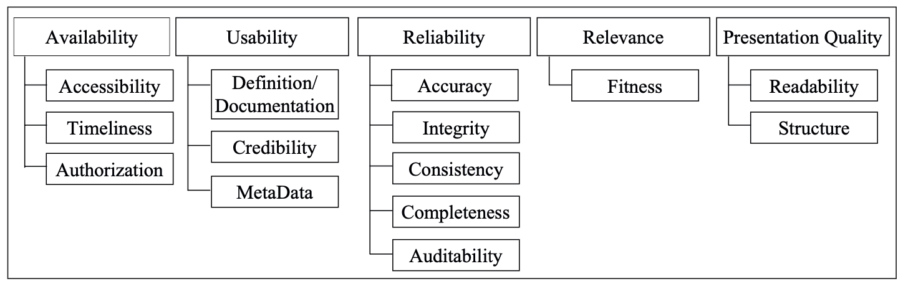 
 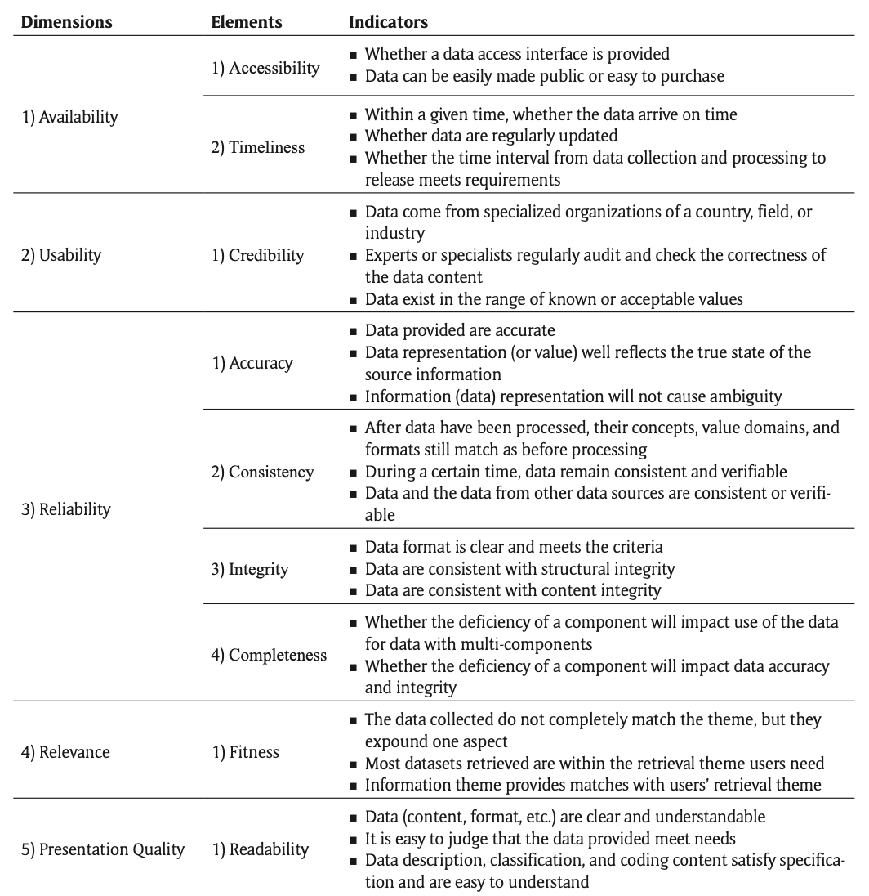 
 

- Accessibility
- Timeliness
- Authorization
- Credibility
- Definition/Documentation
- MetaData
- Accuracy
- Consistency
- Integrity
- Completeness
- Auditability
- Fitness
- Readability
- Structure

## 2.5 Data Quality Problems
 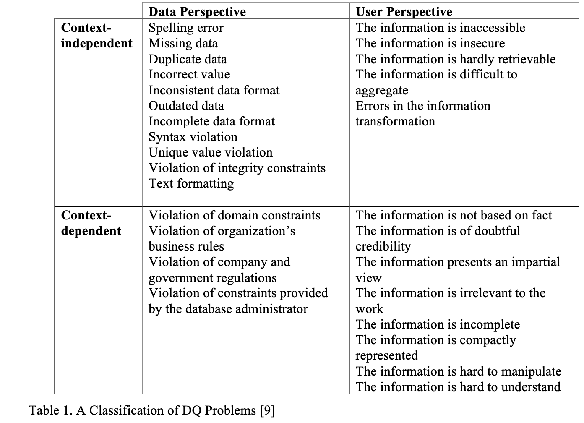
 As the paper is aiming at classifying DQ assessment methods in the context of relational databases, this
 research focuses on the data perspective problems for both context dependent and independent categories and uses the classification of DQ problems identified in [5] (see Table 1). 
 Hence, we provide a brief definition for each DQ problem in the context of our research in the following. 
 In the context independent category, spelling errors, missing data, and incorrect values are self-explanatory DQ problems. 
 Duplicate data problems occur when rows are duplicated or when schemas contain redundancies (that is, specify duplicate attributes in multiple databases). 
 Data format problems occur when two or more semantically equivalent data values have different representations (this includes inconsistent and text formatting DQ problems). 
 Syntax violation problems occur when a pre-specified format has been assigned to an attribute and a data value for this attribute does not adhere to this format (this includes the incomplete data format DQ problem in Table 1). 
 Problems with violations of integrity constraints arise when data values do not adhere to pre-specified database integrity constraints; we also therefore include unique value violations, rather than have these as a separate problem, because unique value violations are one type of database integrity constraint. 
 Note that, despite its position in Table 1, we treat outdated data to be a user perspective problem because whether data is out of date depends on the purpose it is used for.
 For the context dependent category, the problem of violation of domain constraints is when an attribute value must be in a pre-specified context-dependent domain of values. 
 Violation of organizational business rules is when any set of values do not adhere to a pre-specified rules assigned by the organization. 
 Violation of company and governmental regulations is when any set of values do not adhere to a prespecified rules assigned imposed on the organization by legislating bodies. 
 Similarly, violation of constraints provided by the database administrator is when any set of values do not adhere to a pre-specified rules assigned by the database administrator.
 
 # 2.6 Cost
 The cost of a data quality program can be considered a preventive cost that is in- curred by organizations to reduce data errors. This cost category includes the cost of all phases and steps that compose a data quality assessment and improvement process (see Section 2.1).
 The costs of poor quality can be classified as follows [English 1999]:
 (1) process costs, such as the costs associated with the re-execution of the whole process due to data errors;
 (2) opportunity costs due to lost and missed revenues.
 The cost of poor data quality is strongly context-dependent as opposed to the cost of a data quality program. This makes its evaluation particularly difficult, as the same data value and corresponding level of quality has a different impact depending on the recipient. For example, an active trader receiving obsolete information on a stock may incur considerable economic losses as a consequence of wrong investment decisions. In contrast, a newspaper receiving the same obsolete information to publish monthly trading reports may not experience any economic loss.
 
# Literature Review

In this section, 3~5 data quality assessment methods are introduced in brief:

## Total Data Quality Management(TDQM)
 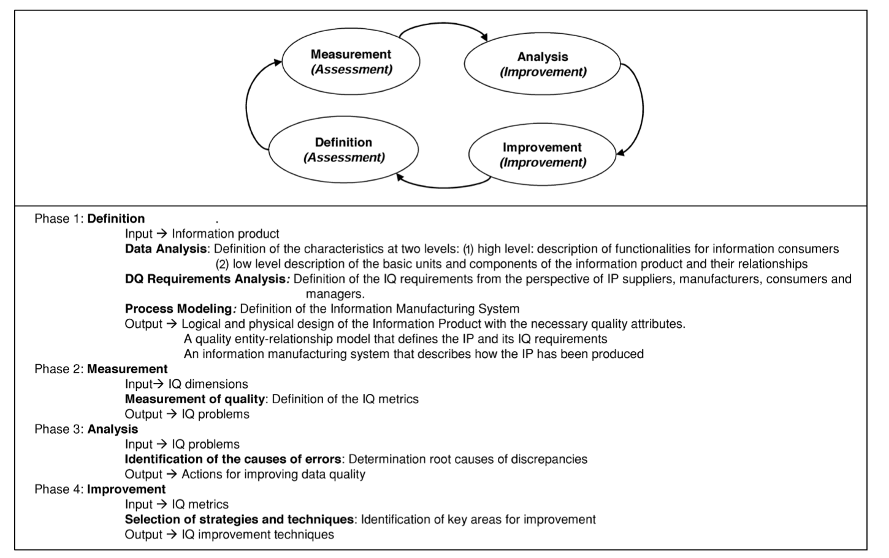
 
- General description: The TDQM methodology was the first general methodology published in the data quality literature [Wang 1998]. 
 TDQM is the outcome of academic research, but has been extensively used as a guide to organizational data reengineering initiatives. 
 The fundamental objective of TDQM is to extend to data quality, the principles of Total Quality Management (TQM) [Oakland 1989].
In operations management, TQM has shifted the focus of reengineering activities from efficiency to effectiveness, by offering methodological guidelines aimed at eliminating discrepancies between the output of operating processes and customers’ requirements. 
Given requirements, reengineering must start from modeling operating processes. 
Consistent with these tenets, TDQM proposes a language for the description of information production (IP) processes, called IP-MAP [Shankaranarayan et al. 2000]. IP-MAP has been variously extended, 
towards UML and also to support organizational design. IP-MAP is the only language for information process modeling and represents a de facto standard. 
Practical experiences with TDQM are reported, for example, in Kovac and Weickert [2002].

- Detailed comments. TDQM’s goal is to support the entire end-to-end quality improvement process, from requirements analysis to implementation. 
As shown in Figure 6(a) TDQM Cycle consists of four phases that implement a continuous quality improvement process: definition, measurement, analysis, and improvement.
The roles responsible for the different phases of the quality improvement process are also defined in TDQM. 
Four roles are distinguished: information suppliers, which create or collect data for the IP, information manufacturers, which design, develop, or maintain data and related system infrastructure, information consumers, which use data in their work, and information process managers, which are responsible for managing the entire information production process throughout the information life cycle.
TDQM is comprehensive also from an implementation perspective, as it provides guidelines as to how to apply the methodology. 
In applying TDQM, an organization must: 
(a) clearly understand the IPs; 
(b) establish an IP team consisting of a senior executive as the TDQM champion, an IP engineer who is familiar with the TDQM methodology, and members who are information suppliers, manufacturers, consumers, and IP managers; 
(c) teach IQ assessment and IQ management to all the IP constituen- cies; and 
(d) institutionalize continuous IP improvement.

TDQM relies on the information quality literature for IQ Criteria and IQ improvement techniques. 
In particular, it explicitly refers to Wang and Strong [1996] for the data quality dimensions specification. 
TDQM relates quality issues to corresponding improvement techniques. 
However, in the recent literature no industry-specific technique is referred and no support is offered to specialize general quality improvement techniques.

## Total Information Quality Management(TIQM)

 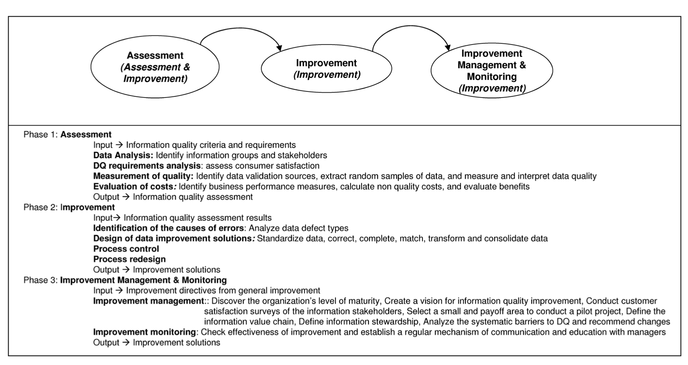

- General description: The TIQM methodology [English 1999] has been designed to support data warehouse projects. 
The methodology assumes the consolidation of operational data sources into a unique, integrated database, used in all types of aggregations performed to build the data warehouse. 
This consolidation eliminates errors and heterogeneities of source databases. 
TIQM focuses on the management activities that are responsible for the integration of operational data sources, by discussing the strategy that has to be followed by the organization in order to make effective technical choices. 
Cost-benefit analyses are supported from a managerial perspective. The methodology provides a detailed classification of costs and benefits (see Section 3.4).

- Detailed comments. Figure 8 shows the phases of the TIQM methodology. 
From the TIQM’s managerial perspective, there are three main phases: assessment, improvement, and improvement management and monitoring. 
One of the valuable contributions of the methodology is the definition of this last phase, which provides guidelines to manage changes in the organization’s structure according to data quality management requirements. 
Furthermore, the economics approach introduces cost benefit evaluation to justify data quality interventions. 
The goal is not only the achievement of higher data quality level, but to undertake improvement actions only if they are feasible; thus only if benefits are greater than costs.

## Data Quality Assessment(DQA) 

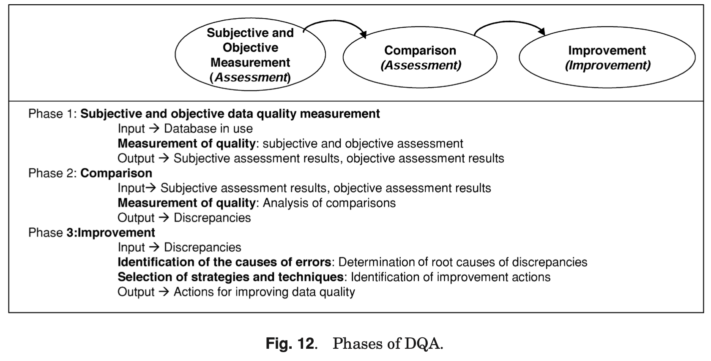

- General description. The DQA methodology [Pipino et al. 2002] has been designed to provide the general principles guiding the definition of data quality metrics. 
In the literature, data quality metrics are mostly defined ad hoc to solve specific problems and thus, are dependent on the considered scenario. 
The DQA methodology is aimed at identifying the general quality measurement principles common to previous research.

- Detailed comments. The classification of metrics of the DQA methodology is summarized in Figure 12. 
The methodology makes a distinction between subjective and objective quality metrics. 
Subjective metrics measure the perceptions, needs, and experiences of the stakeholders. 
Objective metrics are then classified into task-independent and task-dependent. 
The first assess the quality of data without contextual knowledge of the application, while the second are defined for specific application contexts and include business rules, company and government regulations, and constraints provided by the database administration. 
Both metrics are divided into three classes: simple ratio, min or max value, and weighed average.

## Information Quality Measurement(IQM)

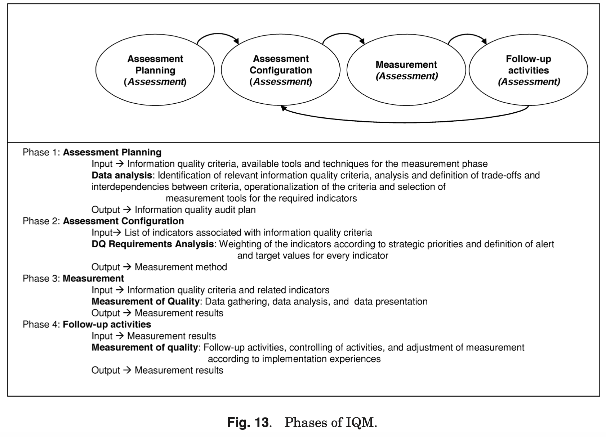

- General description. The fundamental objective of the IQM methodology [Eppler and Mu ̈nzenmaier 2002] is to provide an information quality framework tailored to Web data. 
In particular, IQM helps the quality-based selection and personalization of the tools that support Webmasters in creating, managing, and maintaining Web sites.

- Detailed comments. The IQM methodology provides guidelines to ensure that software tools evaluate all the fundamental information quality dimensions. 
The methodology provides two sets of guidelines: the information quality framework defining quality criteria, and the action plan explaining how to perform quality measurements.
The main phases of IQM methodology are reported in Figure 13. The first phase de- fines the measurement plan. 
The information quality framework is defined as a list of relevant information quality criteria identified by interviewing the information stake- holders. 
The framework is the input for an information quality audit that associates the information quality criteria with the methods and tools that will be used in the measurement process. 
Some criteria require multiple measurement methods. The IQM methodology coordinates the application of multiple measurement methods.

## Comprehensive methodology for Data Quality management(CDQ)

 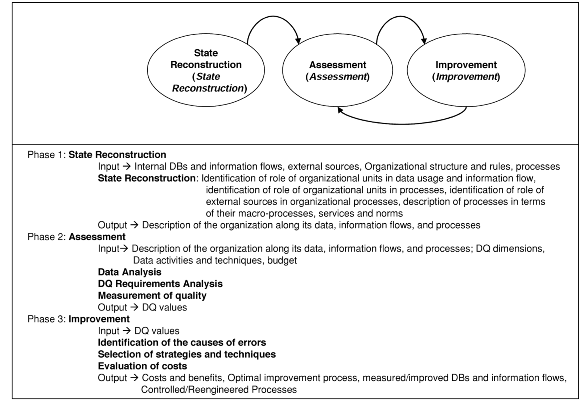
 
- General description. The CDQ methodology [Batini and Scannapieco 2006; Batini et al. 2008] is conceived to be at the same time complete, flexible, and simple to apply. 
Completeness is achieved by considering existing techniques and tools and integrating them in a framework that can work in both intra- and inter-organizational contexts, and can be applied to all types of data, structured, semistructured and unstructured. 
The methodology is flexible since it supports the user in the selection of the most suitable techniques and tools within each phase and in any context. 
Finally, CDQ is simple since it is organized in phases and each phase is characterized by a specific goal and set of techniques to apply.

The CDQ methodology is innovative since it provides support to select the optimal quality improvement process that maximizes benefits within given budget limits. 
Second, it emphasizes the initial requirements elicitation phase. In fact, the other methodologies implicitly assume that contextual knowledge has been previously gathered and modelled. 
The focus is on how to reach total data quality without providing indications as to how to use contextual knowledge. 
A goal of CDQ is instead to obtain a quantitative assessment of the extent to which business processes are affected by bad information.

- Detailed comments. Three main phases characterize the methodology: state reconstruction, assessment, and choice of the optimal improvement process (see Figure 20). 
In the first phase of the methodology, the relationships among organizational units, processes, services, and data are reconstructed. 
These relationships are modelled by using matrixes that describe which organizational units use data and their roles in the different business processes. 
Furthermore, in this phase, processes are described along with their contribution in the production of goods/services and the legal and organizational rules that discipline workflows. 
The second phase sets new target quality levels that are needed to improve process qualities, and evaluates corresponding costs and benefits. 
This phase locates the critical variables affected by poor quality. Since improvement activities are complex and costly, it is advisable to focus on the parts of the databases and data flows that raise major problems. 
Finally, the third phase consists of five steps and is aimed at the identification of the optimal improvement process: the sequence of activities that has the highest cost/effectiveness ratio. 
New target quality levels are set by considering costs and benefits. Different improvement activities can be performed to reach new quality targets. 
The methodology recommends the identifica- tion of all the data-driven and process-driven improvement techniques for the different databases affected by poor quality. 
A set of mutually consistent improvement tech- niques constitutes an improvement process. 
Finally, the most suitable improvement process is selected by performing a cost-benefit analysis.

# 4. Evaluation

(這邊要加上一段)

## 4.1. Methodologies, Phases, and Steps
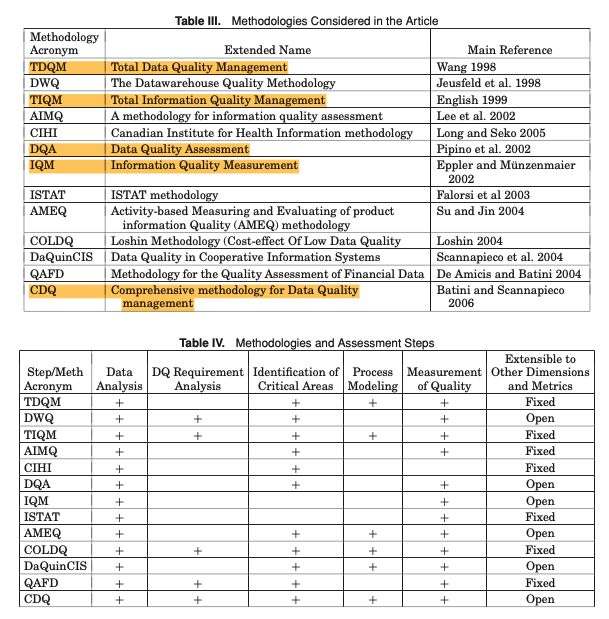

### 4.1.1. The Assessment Phase.

The most commonly addressed steps of the assessment phase are data analysis and measurement of quality. However, they are performed according to different approaches.
For example, the measurement of quality step is performed with questionnaires in AIMQ, with a combination of subjective and objective metrics in DQA
Different measurement approaches meet the specific requirements of different organizational contexts, processes, users or services. Only a few methodolo- gies consider the DQ requirements analysis step, identifying DQ issues and collecting new target quality levels from users. This step is particularly relevant for evaluat- ing and solving conflicts in target DQ levels from different stakeholders. 
### 4.1.2. The Improvement Phase.
The identification of the causes of errors is the most widely addressed improvement step. 
DQA emphasizes the importance of the identification of the causes of errors step, but it does not discuss its execution.
The last column of Table IV specifies whether the methodology allows extensibility to dimensions (and metrics) other than those explicitly dealt with in the methodology. 
For example, CDQ explicitly mentions dimensions among those that will be described in Section 3.3, but the approach can be easily generalized to other dimensions.

In contrast, the management of the improvement solution step is explicitly performed only by TDQM. 
Other methodologies refer to the broad range of management techniques and best practices available from the change management field [Kettinger and Grover 1995]. 
Furthermore, it is possible to repeat the assessment phase of the methodology in order to evaluate the results of the improvement phase. 
As an example, DQA explicitly recommends the application of previous methodological steps to evaluate the effectiveness of improvement.
Finally, the relationship among data quality, process, and organization is considered by TIQM, TDQM, and CDQ. 
These methodologies thoroughly discuss the assignment of responsibilities on processes and data. 
These steps are supported by the results of the state reconstruction phase. 
CDQ discusses a set of matrices to represent the relationship among processes, organizational units, and databases, which are produced during the state reconstruction phase and are subsequently used in the assignment of responsibilities steps.

### 4.2. Strategies and Techniques
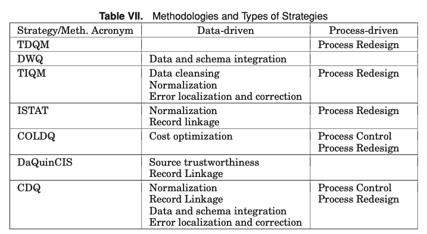

Table VII shows the strategies and techniques adopted by different methodologies. A methodology is associated with a strategy if it provides guidelines to select and design corresponding techniques.
Notice that the column labelled Process-driven in Table VII provides the same in- formation as columns, Process control and Process redesign of Table VI. The column labelled Data-driven explicitly mentions the data-driven techniques implicitly consid- ered in Tables V and VI.
Table VII shows that five DQ methodologies adopt mixed strategies, variously com- bining data-driven and process-driven techniques. The methodology applying the wider range of data- and process-driven techniques is TIQM. Conversely, TDQM provides guidelines to apply process-driven strategies by using the Information Manufacturing Analysis Matrix [Ballou et al. 1998], which suggests when and how to improve data.
Normalization, record linkage, data and schema integration, represent the data- driven techniques most widely adopted in DQ methodologies, while process redesign, as discussed in previous section, is most relevant in process-driven methodologies. We now discuss specific contributions related to the data- and process-driven techniques considered in Section 2.2.
### 4.2.1. Data-Driven Techniques
Normalization techniques have been proposed in sev- eral domains, including census and territorial data domains. 
CDQ provide normalization techniques improving DQ by comparing data with look-up ta- bles and defining a common metaschema. 
Record linkage has been investigated in the database research since the ’50s and has been applied in many contexts such as healthcare, administrative, and census applications. 
In such contexts, it is crucial to produce efficient computer-assisted matching procedures that can reduce the use of clerical resources, and at the same time, minimize matching errors. 
CDQ discusses three types of record linkage techniques:

(1) Probabilistic techniques, based on the broad set of methods developed over the past two centuries within statistics and probability theory, ranging from Bayesian net- works to data mining.
(2) Empirical techniques that make use of algorithmic techniques such as sorting, tree analysis, neighbor comparison, and pruning.
(3) Knowledge-based techniques, extracting knowledge from files and applying reason- ing strategies.
Criteria for choosing among these three types of techniques are discussed within the CDQ methodology. 

CDQ follows an approach similar to ISTAT, with more emphasis on the autonomy of organizations in the cooperative system. 
In fact, the resolution of heterogeneities in the case studies, proposed as best practices, is performed through record linkage on a very thin layer of data, namely the identifiers. 
All other data are reconcilied only in case of autonomous decisions of the agencies involved.

### 4.2.2. Process-Driven Techniques.

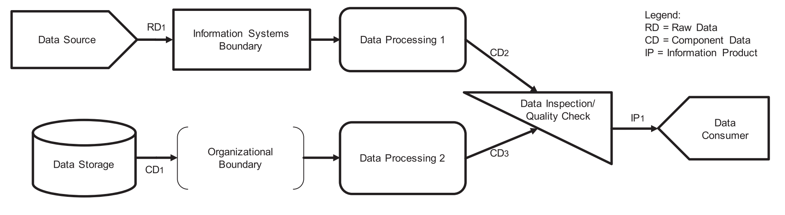
Methodologies addressing the process redesign step tend to borrow corresponding techniques from the literature on business process reengineering (BPR) [Muthu et al. 1999; Hammer 1990]. 
TDQM represents an exception in this respect, as it proposes an original process redesign control approach that is referred to as an “information manufacturing system for the Information Product” [Ballou et al. 1998]. 
This methodology proposes the Information Production Map (IP-MAP) model [Shankaranarayan et al. 2000] that is used to model the information products managed by the manufacturing processes. 
An information production map is a graphical model designed to help analysts to visualize the information production process, identify the ownership of process phases, understand information and organizational boundaries, and estimate the time and quality metrics associated with the current production process. 
The description of processes is a mandatory activity, consistent with the general orientation of process-driven strategies. 
After modelling and assessing the information production process, new process control activities are identified and/or process redesign decisions are taken.

Complex solutions such as IP-MAP cannot always be adopted due to their high costs and, in some cases, the practical unfeasibility of a thorough process modeling step. 
For this reason, other methodologies adopt less formal, but more feasible solutions. 
For example, CDQ is based on a set of matrices that describe the main relationships among data, information flows, processes, and organizational units. 
The relationship between organizational units and processes has also been modeled in extensions of IP-MAP proposed in the literature [Scannapieco et al. 2002].

## 4.3. Dimensions

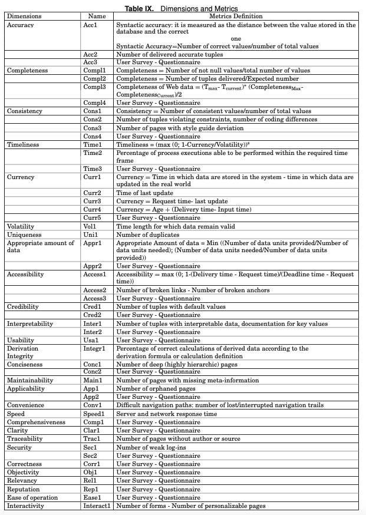
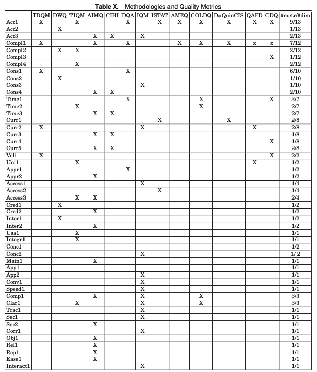

Table VIII shows the quality dimensions considered by the methodologies surveyed in this article. 
In Table VIII, a dimension is associated with a methodology, if the methodology provides a corresponding definition. 
For each methodology’s dimensions, we address the corresponding references (see Table III).

Notice the large variety of dimensions defined in the methodologies, which confirms the complexity of the data quality concept. This is not surprising, since nowadays a large number of phenomena can be described in terms of data. Multiple classifications of quality dimensions are proposed by the methodologies. TIQM classifies dimensions as inherent and pragmatic.
CDQ proposes schema and data dimensions.

Table IX shows the metrics provided for quality dimensions by different methodologies. 
We do not include metrics for semantic accuracy because the methodology addressing it, CDQ, do not provide specific measurement methods. 
In general, multiple metrics are defined for each dimension, and each dimension accordingly has multiple entries in the table. 
Note that subjective metrics such as user surveys have been defined for almost all quality dimensions. 
Different metrics for the same dimension are identified by acronyms, which are used in Table X to associate them with the methodologies in which they are used and/or defined.

The last column of Table X provides for each dimension and each metric associated with the dimension, (1) the number of methodologies that use the metrics, and (2) the total number of methodologies that mention the corresponding dimension. 
The ratio between these values measures the degree of consensus on dimension metrics among methodologies. 
Such consensus is high for accuracy, completeness, and consistency, while it is significantly lower for two of the time-related dimensions, timeliness and currency, and almost all other dimensions.

The majority of metrics with only one occurrence in methodologies are mentioned in IQM, which analyzes the quality of Web information. 
Such metrics are defined by considering the measurement tools that are available in the specific Web context. 
For example, using a site analyzer, it is possible to assess dimensions such as accessibility, consistency, timeliness, conciseness, and maintainability. 
Traffic analyzers can be used to assess applicability and convenience, while port scanners are useful to assess security. 
The high number of measurement tools in the Web context results in a high number of metrics specific to IQM.

## 4.4. Costs
The cost dimension is considered only in TIQM, COLDQ, and CDQ. 
In this section we analyze costs from two different points of view: (1) cost classifications, and (2) criteria provided for cost quantification.
### 4.4.1. Cost Classifications.
Both TIQM [English 1999] and COLDQ [Loshin 2004] pro- vide detailed classifications for costs.
Table XI compares the TIQM and COLDQ classifications. In TIQM, data quality costs correspond to the costs of business processes and data management processes due to poor data quality. Costs for information quality assessment or inspection measure data quality dimensions to verify that processes are performing properly. Finally, process improvement and defect prevention costs involve activities to improve the quality of data, with the goal of eliminating, or reducing, the costs of poor data quality. Costs due to poor data quality are analyzed in depth in the TIQM approach, and are subdivided into three categories:
(1) Process failure costs are incurred when poor quality data causes a process not to per- form properly. As an example, inaccurate mailing addresses cause correspondence to be misdelivered.
(2) Information scrap and rework. When data is of poor quality, they involve several types of defect management activities, such as reworking, cleaning, or rejecting.
(3) Loss and missed opportunity costs correspond to the revenues and profits lost be- cause of poor data quality. For example, due to low accuracy of customer e-mail addresses, a percentage of customers already acquired cannot be reached by peri- odic advertising campaigns, resulting in lower revenues, roughly proportional to the decrease of the accuracy of addresses.

### 4.4.2. Criteria for Cost Quantification.

The assessment of the total cost of data qual- ity supports the selection of the types of data quality activities to be performed (see Section 2.2) and their prioritization. TIQM, COLDQ, and CDQ are the only method- ologies providing criteria for this activity. In TIQM, selection and prioritization are achieved with the following steps:
—identify current users and uses of data;
—list the errors that negatively affect data quality;
—identify the business units most often impacted by poor quality data;
—estimate the direct cost of the current data quality program;
—estimate the costs of data errors for all users and uses of data, grouped by business unit;
—use costs to justify and prioritize data quality initiatives, including the institution- alization of a continuous quality improvement program.
Each type of error occurs with a given frequency and involves a cost. Note that the cost of different error categories is a contingent value that varies with the process that makes use of the data. Models for process representation allow the identification of the activities affected by data errors. Since activities are typically associated with a total organizational cost, the cost of rework can provide quantitative and objective estimates.

In CDQ the minimization of the cost of the data quality program is the main criterion for choosing among alternative improvement processes. First, different improvement processes are identified as paths of data- and process-driven techniques applied to the data bases, data flows, and document bases involved in the improvement. Then, the costs of the different processes are evaluated and compared, and the minimum-cost
process is selected.
## 4.5. Types of Data
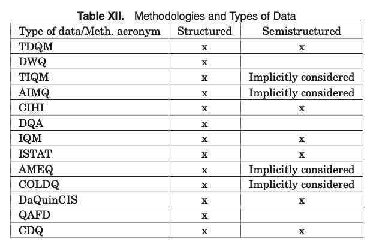
Table XII associates the types of data classified in Section 2.5 and DQ methodologies. 
Most methodologies address structured data, while only a few also address semistructured data. 
In Table XII we have imputed implicitely considered when the methodology does not explicitely mention the type of data, but phases and steps can be applied to it.

## 4.7. Summary Comparison of Methodologies

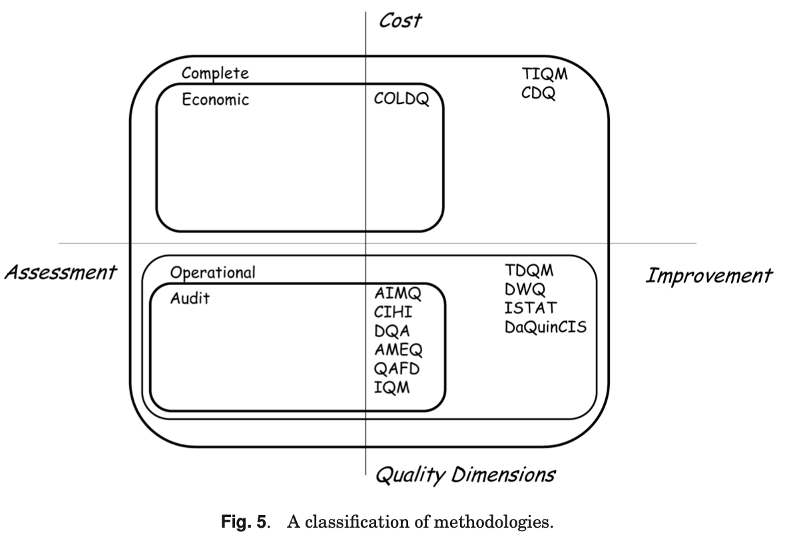

— complete methodologies, which provide support to both the assessment and improvement phases, and address both technical and economic issues;
— audit methodologies, which focus on the assessment phase and provide limited sup-
port to the improvement phase;
— operational methodologies, which focus on the technical issues of both the assessment and improvement phases, but do not address economic issues.
— economic methodologies, which focus on the evaluation of costs.

From a historical perspective, there exists a correlation between quality dimensions and the evolution of ICT technologies.
The evolution of information systems from monolithic to network-based has caused a growth of the number of data sources in both size and scope and, consequently has signif- icantly increased the complexity of data quality management. DQ methodologies have started to focus on new quality dimensions, such as the completeness of the data source, the currency of data, and the consistency of the new data sources compared to the enter- prise database. With the advent of the Web, data sources have become difficult to assess and control over time. At the same time, searching and navigating through the Web is potentially unlimited. As a consequence of this fast evolution, methodologies have started to address new quality dimensions, such as accessibility and reputation. Acces- sibility measures the ability of users to access data, given their culture, physical status and available technologies, and is important in cooperative and network-based informa- tion systems. Reputation (or trustworthiness) is a property of data sources measuring

Operational methodologies focus DQ assessment on identifying the issues for which their improvement approach works best. One of the main contributions is the identifica- tion of a set of relevant dimensions to improve and the description of a few straightfor- ward methods to assess them. For example, TDQM is a general-purpose methodology and suggests a complete set of relevant dimensions and improvement methods that can be applied in different contexts. 
Complete methodologies are extremely helpful in providing a comprehensive frame- work to guide large DQ programs in organizations that process critical data and at- tribute to DQ a high strategic priority, such as banks and insurance companies. On the other hand, they show the classical tradeoff between the applicability of the method- ology and the lack of personalization to specific application domains or technological contexts. Being high-level and rather context independent, complete methodologies are only marginally affected by the evolution of ICT technologies and, over time have been revised to encompass the variety of data types, sources, and flows that are part of modern information systems. For example, the IP-MAP model of TDQM has evolved to IP-UML in order to manage the growing complexity of systems in terms of processes and actors. However, its role and use within the overall framework of TDQM has not changed significantly.
Economic methodologies complement other methodologies and can be easily posi- tioned within the overall framework provided by any complete methodology. Most audit and improvement methodologies have a cost evaluation step (see Table XI). However, they mostly focus on the cost of DQ initiatives, while a complete cost-benefit analysis should also consider the cost of doing nothing—the cost of poor data quality, which is typically of an organizational nature. Economic methodologies focus on both aspects.
In CDQ, the overall evaluation of the cost of poor quality is further developed to take into account the fact that the same quality improvement can be obtained with different priorities and paths and the minimization of the cost of the data quality program is the main criterion to choose among alternative improvement
processes. The methodology suggests that different improvement processes can iden- tified as paths of data- and process-driven techniques applied to the data bases, data flows and document bases involved in the improvement. Then, the costs of the different processes should be evaluated and compared, to select the minimum-cost process.
(這段講到經驗可以跳過)
Experiences of use of early TDQM versions are reported in several U.S.A. Department of Defence (DoD) documents (see US Department of Defense [1994]). Specifically, the use of DQ tools developed over SQL scripts and programming approaches to check data quality are supported. 
In Batini and Scannapieco [2006], a large-scale experience of the application of CDQ is reported, referring to the reorganization of Government to Business (G2B) relation- ships in Italy. The interactions with government are needed for several business events, such as starting a new business and evolving a business, which includes variations in legal status, board composition, senior management, and number of employees.

# 5 Conclusions

## Challenges
可以參考The Challenges of Data Quality and Data Quality Assessment in the Big Data Era